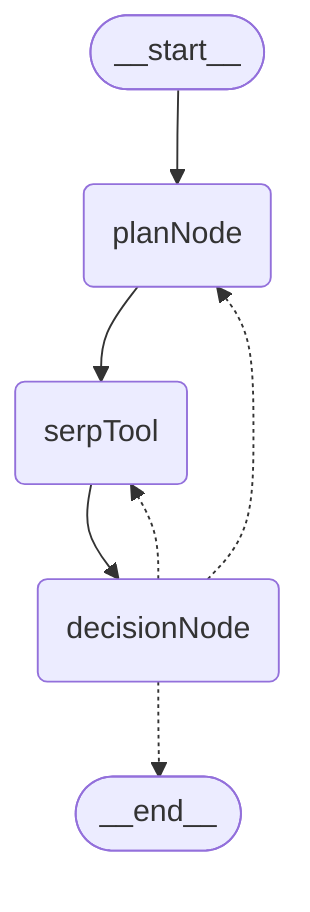

# fastgraph
langgraph+fasthtml

```mermaid
graph TD;
	__start__([__start__]):::first
	planNode(planNode)
	serpTool(serpTool)
	decisionNode(decisionNode)
	__end__([__end__]):::last
	__start__ --> planNode;
	planNode --> serpTool;
	serpTool --> decisionNode;
	decisionNode -.-> planNode;
	decisionNode -.-> serpTool;
	decisionNode -.-> __end__;	
```
